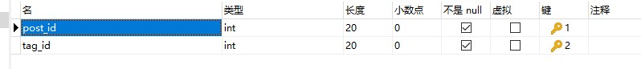

# BBS
ncu.springboot.bbs

### 制作人员：赖金明  柴宇皓  沈琪浩 徐伟 卢韬

### 用户模块：

发帖模块：在用户登录之后可以发布自己想发布的帖子，可选项包括帖子是否有悬赏积分，添加帖子标签，亦可修改自己帖子内容，删除自己帖子

回复模块：在用户登录之后可以在任意帖子下回复，如果回复被采纳，即可获取帖子悬赏的积分，如果用户没有登陆，可以浏览帖子，但不可以评论回复

### 管理员模块：

在登陆管理员账户之后，可以给高分帖子置顶，加精，也可以删除用户帖子

### 数据库：

#### user 

用户id，用户名，密码，手机号，工作性值，工作地点，是否管理员账户，用户初始积分，用户邮箱（用户id和用户邮箱不能为空）

其中用户id设置为主键

#### post

帖子id，发帖用户id，帖子标题，帖子内容，帖子是否被置顶，帖子是否被加精，帖子发布时间，帖子总浏览数，帖子是否有悬赏分，帖子悬赏分值，帖子是否解决

其中，帖子的id设置为主键，且为自增类型（帖子id和用户id不能为空，用户id为user表的外键）

#### comment

帖子id，用户id，评论内容，评论时间，评论是否被采纳（帖子id为post表的外键，用户id为user表的外键）

#### tag

标签id，标签名称

标签id为主键且不为空

#### post_tag

帖子id，标签·id

帖子id为主键，且为post表的外键，标签id为主键，且为tag表的外键

#### 采用前后端分离，前端使用vue框架，后端使用springboot,jpa